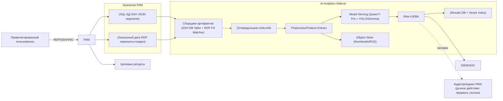
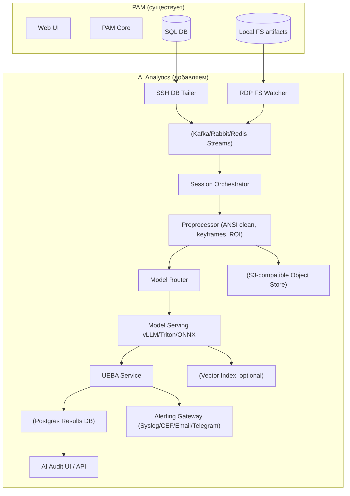
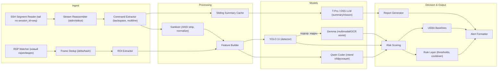
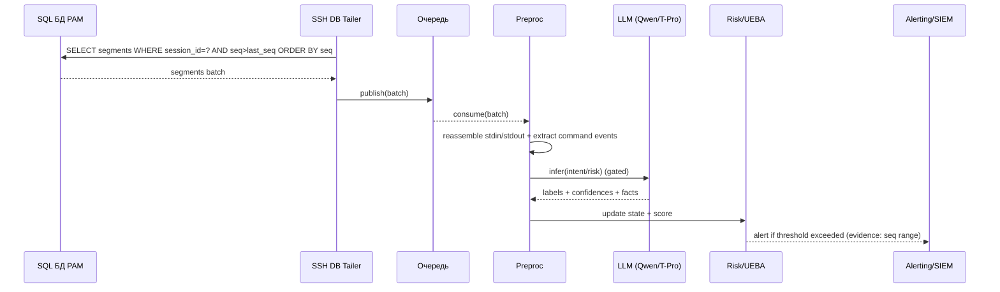
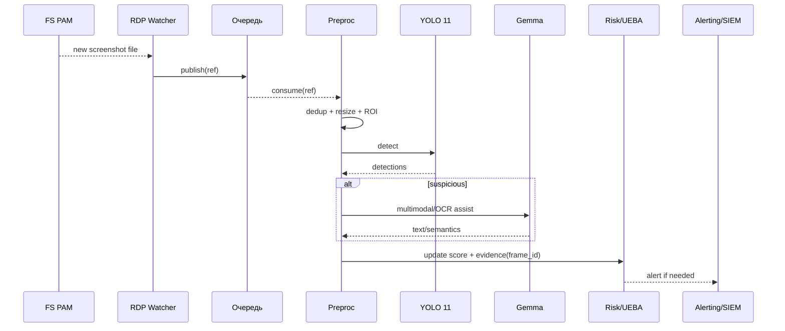

# System Design — AI аналитика PAM-сессий — Архитектура (C1–C4)

> Этот файл: архитектура, диаграммы C1–C4, потоки данных, хранилища, наблюдаемость.

---

## 1. Архитектурные принципы
1) **Sidecar (out-of-band)**: AI не участвует в контуре “разрешить доступ”.
2) **Потоковая обработка**: SSH — near-real-time (tail по seq), RDP — micro-batch (скриншоты).
3) **Идемпотентность**: каждый алерт/отчёт имеет dedup_key.
4) **Деградация по нагрузке**: при перегрузе отключаем тяжёлые модели (Gemma), оставляем YOLO/правила.

---

## 2. C1 — System Context

---

## 3. C2 — Containers

---

## 4. C3 — Components (внутри AI Analytics)

---

## 5. C4 — Runtime sequences

### 5.1 SSH near-real-time (tail по seq)

### 5.2 RDP micro-batch (скриншоты)

---

## 6. Хранилища и модель данных (Results)

### 6.1 Postgres (предложение)
- `ai_session_state(session_id, protocol, user_id, resource_id, start_ts, end_ts, status, risk_current, risk_max, summary_final, ...)`
- `ai_evidence(evidence_id, session_id, ts, type, severity, payload_json, pointer_obj, ...)`
- `ai_alerts(alert_id, session_id, ts, severity, dedup_key, delivery_status, ...)`
- `ueba_profile(user_id, baseline_json, updated_ts, ...)`

### 6.2 Object Store (MinIO/S3)
- `/evidence/{session_id}/{frame_id}.jpg` (thumbnail/ROI)
- `/evidence/{session_id}/{seq_from}_{seq_to}.json` (фрагменты команд, если нужно)

---

## 7. Наблюдаемость (Observability)
- Метрики:
  - lag по `seq` и lag по кадрам
  - P95/P99 latency end-to-end
  - GPU utilization, очередь, ошибки inference
  - FP rate (по фидбеку аудиторов)
- Логи:
  - structured JSON с `session_id`, `evidence_id`
- Tracing:
  - OpenTelemetry: ingest → preprocess → inference → decision → alert

---

## 8. Деградация и backpressure
- Если очередь растёт:
  - снижать частоту RDP обработки (sampling)
  - отключать Gemma (оставить YOLO)
  - увеличивать batch по SSH
- Если GPU недоступен:
  - fallback на правила/эвристику (SSH)
  - пропуск deep анализа (RDP), но сохранять доказательства для постфактум

